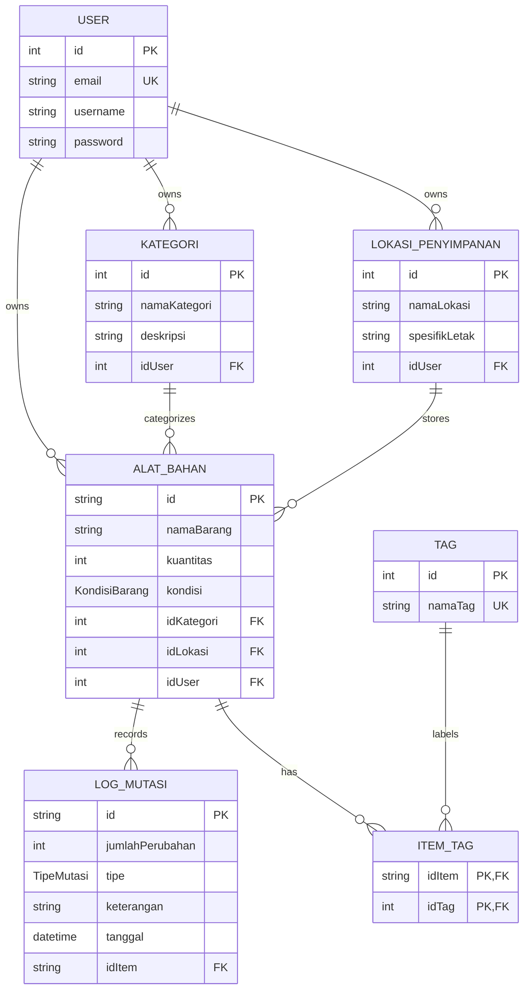

# AGENTS.md

> File ini SELALU ke-load ke context agent di tiap request.
> Isi harus general & stabil — jangan taruh detail task yang berubah-ubah di sini.
> Kalau tool-mu pakai nama lain (CLAUDE.md, .cursorrules, instructions.md),
> buat SYMLINK ke file ini. Jangan duplikat isi manual:
> ln -s AGENTS.md CLAUDE.md

---

## 1. Tech Stack

**Backend**

- Runtime: Bun
- Framework: NestJS
- ORM: Prisma
- Database: PostgreSQL
- Auth: JWT melalui global `APP_GUARD` dan `JwtAuthGuard`

**Frontend**

- Build tool: Vite
- Framework: React 19 + TypeScript
- Styling: Tailwind CSS v4 (`@tailwindcss/vite`, tanpa `tailwind.config.js`)
- UI Components: shadcn/ui
- Routing: react-router-dom v7
- State: Zustand (+ persist middleware)
- Data fetching: Tanstack Query (kalau dipakai) / Axios langsung
- Form: react-hook-form + zod

**Tooling**

- Package manager: Bun (jangan campur npm/yarn di project yang sama)
- Backend linter: Oxlint
- Frontend linter: ESLint + typescript-eslint
- Formatter backend: Prettier

---

## 2. Commands

Backend dijalankan dari `backend/`, frontend dari `frontend/`. Tidak ada `package.json` di root.

```bash
# Backend
bun run start:dev
bun run build
bun run lint
bun test
bun run test:e2e
bun run format

# Frontend
bun run dev
bun run build
bun run lint
bun run preview

# Prisma 8; jalankan dari backend/
bunx prisma db init
bunx prisma db sign
bunx prisma db migrate
bunx prisma migration plan
bunx prisma contract emit
```

Dari root, gunakan `bun run --cwd backend <script>` atau `bun --cwd frontend run <script>`. Production backend memakai `bun dist/src/main.js` melalui script `start:prod`, karena auth menggunakan `Bun.password`.

> Update section ini kalau ada command baru yang sering dipakai berulang.

---

## 3. Struktur Folder

```
inventory-manager/
├── AGENTS.md
├── backend/
│   ├── prisma.config.ts
│   ├── prisma/schema.prisma
│   ├── migrations/
│   └── src/
│       ├── auth/ user/ category/ location/
│       ├── alat-bahan/ tag/ dashboard/
│       ├── common/ config/ prisma/
│       └── generated/prisma/
└── frontend/
    └── src/
        ├── assets/ components/ constants/
        ├── features/ hooks/ lib/ pages/
        ├── routes/ store/ utils/
```

> Kalau bukan monorepo, sesuaikan — yang penting agent tahu di mana backend
> dan frontend berada relatif satu sama lain.

---

## 4. Coding Convention & Pattern

- **Naming**: camelCase untuk variable/function, PascalCase untuk komponen React & class, kebab-case untuk nama file non-komponen.
- **NestJS module pattern**: setiap domain punya `*.module.ts`, `*.controller.ts`, `*.service.ts`, `dto/`, `entities/` (kalau perlu). Jangan taruh logic bisnis di controller.
- **DTO validation**: selalu pakai `class-validator` di NestJS DTO, dan samakan aturan validasinya dengan skema `zod` di frontend bila input yang sama dipakai di kedua sisi.
- **Swagger DTO**: gunakan `@ApiProperty()` atau `@ApiPropertyOptional()` pada setiap properti, dengan `example` dan `description`; gunakan metadata `enum` dan `type: [Number]` untuk array jika relevan.
- **Mapped DTO**: manfaatkan metadata dari `PartialType`/`IntersectionType` dan hindari duplikasi yang tidak perlu.
- **Backend imports**: pertahankan suffix `.js` pada import TypeScript ESM backend.
- **React**: komponen fungsional + hooks saja, tidak ada class component. Logic berat (fetch, state kompleks) dipisah ke custom hook, bukan ditulis langsung di body komponen.
- **Export komponen**: pakai `export default function ComponentName()` untuk komponen halaman/feature (1 komponen utama per file). Untuk komponen kecil reusable di `components/ui/`, ikuti pola named export bawaan shadcn — jangan campur gaya di file yang sama.

### 4.1 Backend Auth, Controller, dan Response

- JWT authentication aktif secara global melalui `APP_GUARD` dan `JwtAuthGuard` di `src/common/guards/`.
- Endpoint publik harus memakai decorator `@Public()` yang sudah tersedia; jangan menduplikasi pemeriksaan token manual.
- Setiap controller gunakan `@ApiTags()`. Setiap endpoint gunakan `@ApiOperation()` dan `@ApiResponse()`.
- Endpoint terlindungi harus didokumentasikan dengan `@ApiBearerAuth()`.
- `ValidationPipe` global memakai `whitelist`, `forbidNonWhitelisted`, `transform`, dan implicit conversion.
- Business logic tetap berada di service, bukan controller.

Response sukses dari `TransformInterceptor` berbentuk:

```json
{
  "statusCode": 200,
  "message": "Permintaan berhasil diproses",
  "data": {}
}
```

Gunakan exception NestJS seperti `BadRequestException`, `UnauthorizedException`, `NotFoundException`, dan `ConflictException`; jangan mengembalikan object error manual dari service.

### 4.2 Frontend — State Management (kapan pakai apa)

| Kebutuhan                                          | Pakai                                                                |
| -------------------------------------------------- | -------------------------------------------------------------------- |
| State lokal 1 komponen (form input, toggle, dsb)   | `useState`                                                           |
| Data dari server (list, detail, apa pun hasil GET) | Tanstack Query (`useQuery`) — jangan `useEffect` + `useState` manual |
| Mutasi ke server (create/update/delete)            | Tanstack Query (`useMutation`), lalu `invalidateQueries`             |
| State global lintas halaman (auth, theme, cart)    | Zustand                                                              |
| State form dengan validasi                         | `react-hook-form` + `zod`, jangan `useState` per field               |

> Aturan: kalau data berasal dari API, JANGAN disimpan di Zustand kecuali
> memang perlu diakses di banyak halaman tanpa refetch (contoh: `user` yang
> sedang login). Data list/detail biarkan di-cache oleh Tanstack Query.

### 4.3 Frontend — Loading, Error & Empty State

Setiap komponen yang fetch data wajib handle 3 kondisi ini, jangan cuma
happy path:

```tsx
const { data, isLoading, isError } = useProductList();

if (isLoading) return <Skeleton />;
if (isError) return <ErrorState message="Gagal memuat data" />;
if (!data?.length) return <EmptyState message="Belum ada produk" />;

return <ProductList data={data} />;
```

### 4.4 Frontend — Notifikasi

- Pakai satu library toast konsisten (mis. `sonner`, sudah kompatibel shadcn) untuk semua feedback aksi (sukses/gagal submit, dsb).
- **Jangan** pakai `alert()`/`confirm()` browser bawaan.

### 4.5 Frontend — Environment Variables

- Semua env var frontend wajib prefix `VITE_` (syarat Vite biar ke-expose ke client).
- Setiap env var baru **wajib** ditambahkan ke `.env.example` di commit yang sama — jangan biarkan `.env.example` basi.

### 4.6 Frontend — Type Sharing dengan Backend

- Kalau backend & frontend dalam satu monorepo: pertimbangkan folder `packages/shared-types/` berisi type/interface DTO yang di-import kedua sisi, biar gak perlu tulis ulang manual dan gak gampang out-of-sync.
- Kalau terpisah repo: tulis ulang type di frontend sesuai response backend, tapi **wajib update** begitu ada perubahan field di DTO backend — catat di section "Kesalahan yang Sering Terjadi" kalau ini sering kelewat.

### 4.7 Frontend — Routing

- Route yang butuh auth wajib lewat `<ProtectedRoute />` (lihat `src/routes/ProtectedRoute.tsx`), jangan cek `isAuthenticated` manual di tiap halaman.
- Halaman besar/jarang diakses (settings, admin panel) pakai `React.lazy()` + `<Suspense>` biar bundle awal tetap kecil.

- **API response shape** (standar, jangan diubah tanpa update di dua sisi):
  ```json
  { "statusCode": 200, "message": "", "data": {} }
  ```
- **Error handling**: backend selalu lempar exception NestJS bawaan (`BadRequestException`, dll), jangan return object error manual dari service.
- **Commit message**: `<type>: <deskripsi singkat>` — type: `feat`, `fix`, `chore`, `refactor`, `docs`.

### 4.8 Environment Variables

- Backend memakai `backend/.env`, dimuat oleh `ConfigModule` dan `dotenv`.
- Variabel wajib backend: `DATABASE_URL` dan `JWT_SECRET`; lihat `backend/.env.example`.
- Variabel telemetry opsional: `OBSERVE_APP_KEY` dan `OBSERVE_APP_SECRET`; gunakan kredensial Nest Observe yang valid.
- Jangan pernah mencetak nilai secret di log atau output tool.
- Semua env var frontend wajib memakai prefix `VITE_` dan harus ditambahkan ke `frontend/.env.example`.

---

## 5. Database Diagram

> Update diagram ini tiap kali skema Prisma berubah. Sangat membantu agent
> paham relasi data tanpa harus baca ulang `schema.prisma` tiap kali.



---

## 6. API Reference

Authentication is required by the global JWT guard unless the endpoint is marked `@Public()`.

| Controller     | Base route           | Purpose                                                         |
| -------------- | -------------------- | --------------------------------------------------------------- |
| Health         | `/health`            | Health check; public                                            |
| Authentication | `/auth`              | Register and login; public                                      |
| Users          | `/user`              | User lookup and administration                                  |
| Categories     | `/category`          | Category CRUD                                                   |
| Locations      | `/location`          | Storage location CRUD                                           |
| Inventory      | `/alat-bahan`        | Inventory CRUD, stock changes, mutation history, and CSV export |
| Tags           | `/tag`               | Tag CRUD and item-tag relationships                             |
| Dashboard      | `/dashboard/summary` | Authenticated inventory summary                                 |

API documentation endpoints:

- Swagger UI: `http://localhost:3000/api`
- Scalar API Reference: `http://localhost:3000/reference`
- OpenAPI JSON: `http://localhost:3000/api-json`

---

## 7. Kesalahan yang Sering Terjadi

> **Wajib diupdate** begitu agent melakukan kesalahan yang sama 2x+.
> Format: masalah → kenapa salah → cara benar.

- **Lupa plugin `@tailwindcss/vite` di `frontend/vite.config.ts`** → styling Tailwind tidak berjalan meski package sudah terpasang. Cek plugin sebelum debug hal lain.
- **Menulis validasi hanya di satu sisi** → data lolos frontend tetapi ditolak backend, atau sebaliknya. Update schema Zod dan DTO NestJS bersamaan bila inputnya sama.
- **Menggunakan import relatif panjang di frontend** → alias `@/` sudah diarahkan ke `frontend/src`; gunakan alias tersebut.
- _(tambahkan terus seiring project berjalan)_

---

## 8. Maintenance

- `backend/src/generated/prisma/` adalah generated output. Ubah contract/configuration lalu regenerate; jangan mengedit file generated langsung.
- Backend lint saat ini memiliki warning unused variable yang sudah ada di `src/auth/auth.service.ts` dan `src/dashboard/dashboard.service.ts`; jangan memperbaikinya dalam task yang tidak terkait.
- Sebelum menyelesaikan perubahan backend, jalankan `bun run --cwd backend build`; untuk frontend jalankan build dan lint dari `frontend/` bila relevan.
- Jika arsitektur, command, response contract, atau schema database berubah, update section terkait di file ini pada perubahan yang sama.
